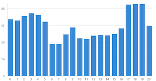

# OPUS-MT dashboard

A web-interface for the exploring and comparing the performance of open machine translation models based on scores collected in the [OPUS-MT leader board repository](https://github.com/Helsinki-NLP/OPUS-MT-leaderboard).

The [live dashboard](https://opus.nlpl.eu/dashboard/) is available at https://opus.nlpl.eu/dashboard/

## Installation

The interface is based on a lightweight implementation in PHP. The setup only requires a web browser with PHP and GD extensions installed. Simply clone the repository and put the sub-diretory `web` into a location that can be accessed from the web and that allows the execution of PHP scripts. Data will be pulled automatically from the [OPUS-MT leader board repository](https://github.com/Helsinki-NLP/OPUS-MT-leaderboard) and the OPUS-MT object storage as needed. Temporary disk space will be used for caching files.

## Usage

TODO
